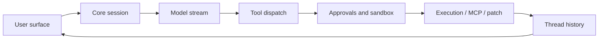

# Codex Hacker's Guide

> Scope: a code-first tour of the Rust Codex implementation in this checkout.
> Every request enters through a user surface such as `codex-rs/tui`, `codex-rs/exec`, or
> `codex-rs/app-server`, crosses into `codex-rs/core`, emits `codex-rs/protocol` events,
> and is projected back through the active client surface.

## 1. How to read this guide

Run probes with:

```bash
python3 hacks/001_protocol_lifecycle.py
```

Note: these probe commands are valid references for this plan and become runnable once the probe harness and probe scripts are added in later tasks.

Probe IDs use three digits so the catalog can grow into hundreds of focused exercises.

## 2. 30-second architecture

| Box | File | Symbol |
| --- | --- | --- |
| User surface | `codex-rs/tui/src/app_command.rs:39` | `UserTurn` |
| Exec | `codex-rs/exec/src/lib.rs:770` | `TurnStartParams` |
| App server | `codex-rs/app-server/README.md:76` | `Core Primitives` |
| Core session | `codex-rs/core/src/session/mod.rs:366` | `struct Codex` |
| Model stream | `codex-rs/core/src/stream_events_utils.rs:126` | `record_completed_response_item` |
| Tool dispatch | `codex-rs/core/src/tools/router.rs:38` | `struct ToolRouter` |
| Approvals and sandbox | `codex-rs/protocol/src/permissions.rs:195` | `FileSystemSandboxPolicy` |
| Execution / MCP / patch | `codex-rs/core/src/session/mcp.rs:251` | `call_tool` |
| Thread history | `codex-rs/protocol/src/protocol.rs:2769` | `enum RolloutItem` |
| Protocol | `codex-rs/protocol/src/protocol.rs:1262` | `enum EventMsg` |
| App event mapping | `codex-rs/app-server-protocol/src/protocol/event_mapping.rs:30` | `fn item_event_to_server_notification` |



## 3. Turn lifecycle overview

The canonical turn path is user input, turn context, model request, streamed response items,
tool execution, event projection, persistence, and final response.

Try it: `hacks/001_protocol_lifecycle.py`

## 14. Sub-agents and collaboration

| Box | File | Symbol |
| --- | --- | --- |
| Agent control | `codex-rs/core/src/agent/control.rs:136` | `struct AgentControl` |
| Agent registry | `codex-rs/core/src/agent/registry.rs:23` | `struct AgentRegistry` |
| Mailbox | `codex-rs/core/src/agent/mailbox.rs:11` | `struct Mailbox` |
| Sub-agent source | `codex-rs/protocol/src/protocol.rs:2564` | `enum SubAgentSource` |
| Collab item mapping | `codex-rs/app-server-protocol/src/protocol/event_mapping.rs:75` | `CollabAgentSpawnBegin` |

Note: probe scripts in this section are documented in advance and can be executed after the relevant harness tasks are implemented.

Try it: `hacks/100_agent_registry_limits.py`

## 18. Hands-on hacks

| # | Script | Pairs with guide section | Kind | Description |
| --- | --- | --- | --- | --- |
| 001 | `hacks/001_protocol_lifecycle.py` | §3 | fixture | Print the core turn lifecycle event map. |
| 002 | `hacks/002_response_stream_fixture.py` | §3 | fixture | Inspect response stream item handling markers. |
| 003 | `hacks/003_turn_context_config.py` | §3 | fixture | Trace turn context and config marker wiring. |
| 004 | `hacks/004_tool_dispatch_matrix.py` | §3 | fixture | Print the tool routing matrix. |
| 005 | `hacks/005_approval_sandbox_decision.py` | §3 | fixture | Inspect approval and sandbox decision markers. |
| 006 | `hacks/006_shell_exec_safe_command.py` | §3 | fixture | Exercise a safe shell execution shape. |
| 007 | `hacks/007_apply_patch_fixture.py` | §3 | fixture | Inspect apply_patch event and tool markers. |
| 008 | `hacks/008_thread_rollout_fixture.py` | §3 | fixture | Trace rollout persistence markers. |
| 009 | `hacks/009_app_server_event_projection.py` | §3 | fixture | Inspect app-server event projection markers. |
| 010 | `hacks/010_capstone_stub_turn.py` | §3 | simulated | Simulate a full turn with stub model and tool output. |
| 100 | `hacks/100_agent_registry_limits.py` | §14 | fixture | Show spawn depth and thread limit rules. |
| 101 | `hacks/101_subagent_source_shape.py` | §14 | fixture | Inspect sub-agent source protocol shape. |
| 102 | `hacks/102_agent_role_resolution.py` | §14 | fixture | Trace role resolution markers. |
| 103 | `hacks/103_mailbox_delivery.py` | §14 | fixture | Inspect mailbox delivery mechanics. |
| 104 | `hacks/104_collab_event_mapping.py` | §14 | fixture | Trace collaboration event mapping. |
| 105 | `hacks/105_spawn_edge_history.py` | §14 | fixture | Inspect spawn edge history markers. |
| 106 | `hacks/106_subagent_resume_tree.py` | §14 | fixture | Trace resume tree markers. |
| 107 | `hacks/107_capstone_stub_subagents.py` | §14 | simulated | Simulate spawn, send, wait, complete, and close. |
| 140 | `hacks/140_live_subagent_spawn_gated.py` | §14 | gated-live | Placeholder for a gated live sub-agent spawn probe. |
