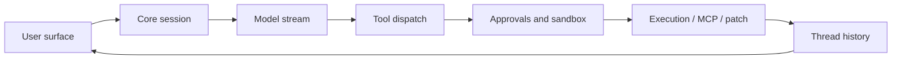

# Codex Hacker's Guide

> Scope: a code-first tour of the Rust Codex implementation in this checkout.
> Every request enters through a user surface such as `codex-rs/tui`, `codex-rs/exec`, or
> `codex-rs/app-server`, crosses into `codex-rs/core`, emits `codex-rs/protocol` events,
> and is projected back through the active client surface.

## 1. How to read this guide

Run probes with:

```bash
python3 hacks/001_protocol_lifecycle.py
```

Probe IDs use three digits so the catalog can grow into hundreds of focused exercises.

## 2. 30-second architecture

| Box | File | Symbol |
| --- | --- | --- |
| TUI | `codex-rs/tui/src/app_command.rs:39` | `UserTurn` |
| Exec | `codex-rs/exec/src/lib.rs:50` | `TurnStartParams` |
| App server | `codex-rs/app-server/README.md:76` | `Core Primitives` |
| Core session | `codex-rs/core/src/session/mod.rs:360` | `struct Codex` |
| Protocol | `codex-rs/protocol/src/protocol.rs:1433` | `enum EventMsg` |
| App event mapping | `codex-rs/app-server-protocol/src/protocol/event_mapping.rs:29` | `fn item_event_to_server_notification` |



## 3. Turn lifecycle overview

The canonical turn path is user input, turn context, model request, streamed response items,
tool execution, event projection, persistence, and final response.

Try it: `hacks/001_protocol_lifecycle.py`

## 14. Sub-agents and collaboration

| Box | File | Symbol |
| --- | --- | --- |
| Agent control | `codex-rs/core/src/agent/control.rs:110` | `struct AgentControl` |
| Agent registry | `codex-rs/core/src/agent/registry.rs:17` | `struct AgentRegistry` |
| Mailbox | `codex-rs/core/src/agent/mailbox.rs:11` | `struct Mailbox` |
| Sub-agent source | `codex-rs/protocol/src/protocol.rs:2564` | `enum SubAgentSource` |
| Collab item mapping | `codex-rs/app-server-protocol/src/protocol/event_mapping.rs:75` | `CollabAgentSpawnBegin` |

Try it: `hacks/100_agent_registry_limits.py`

## 18. Hands-on hacks

| # | Script | Pairs with guide section | Kind | Description |
| --- | --- | --- | --- | --- |
| 001 | `hacks/001_protocol_lifecycle.py` | §3 | fixture | Print the core turn lifecycle event map. |
| 010 | `hacks/010_capstone_stub_turn.py` | §3 | simulated | Simulate a full turn with stub model and tool output. |
| 100 | `hacks/100_agent_registry_limits.py` | §14 | fixture | Show spawn depth and thread limit rules. |
| 107 | `hacks/107_capstone_stub_subagents.py` | §14 | simulated | Simulate spawn, send, wait, complete, and close. |
