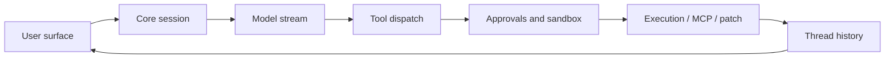

# Codex Architecture Explorer Implementation Plan

> **For agentic workers:** REQUIRED SUB-SKILL: Use superpowers:subagent-driven-development (recommended) or superpowers:executing-plans to implement this plan task-by-task. Steps use checkbox (`- [ ]`) syntax for tracking.

**Goal:** Build a static Codex architecture explorer, guide, generated manifests, and smoke-tested probe suite focused on the turn lifecycle and sub-agent collaboration.

**Architecture:** `CODEX_HACKERS_GUIDE.md` and `hacks/` are the source of truth. Python generator scripts parse the guide and repo source refs into static JSON under `explorer/public/data/`; a Vite/React app renders lifecycle, sub-agent, subsystem, and hack views without executing local code.

**Tech Stack:** Markdown, Python 3 standard library, pytest, React, TypeScript, Vite, Tailwind 4, lucide-react, local static JSON manifests.

---

## File Structure

- Create `CODEX_HACKERS_GUIDE.md`: source-of-truth narrative, architecture tables, guide sections, and `Try it` probe refs.
- Create `hacks/README.md`: probe catalog grouped by three-digit bands.
- Create `hacks/_utils.py`: shared helpers for repo root discovery, stable printing, fixture loading, and gated-skip behavior.
- Create `hacks/001_protocol_lifecycle.py` through `hacks/010_capstone_stub_turn.py`: deterministic lifecycle probes.
- Create `hacks/100_agent_registry_limits.py` through `hacks/107_capstone_stub_subagents.py` plus `hacks/140_live_subagent_spawn_gated.py`: sub-agent probes.
- Create `tests/hacks/test_hacks_smoke.py`: runs non-gated probes with a timeout.
- Create `explorer/package.json`, `explorer/index.html`, `explorer/vite.config.ts`, `explorer/tsconfig*.json`, `explorer/eslint.config.js`: Vite app scaffold.
- Create `explorer/src/*`: React views and shared explorer kit.
- Create `explorer/scripts/build_component_manifest.py`: parse guide into lifecycle/subsystem/hack manifest.
- Create `explorer/scripts/build_subagent_manifest.py`: parse or validate sub-agent graph data.
- Create `explorer/scripts/workflow.sh`: regenerate data, run hack smoke tests, typecheck, and build.
- Create `explorer/public/data/*.json`: generated static manifests committed for reviewability.

## Task 1: Guide Skeleton And Probe Catalog

**Files:**
- Create: `CODEX_HACKERS_GUIDE.md`
- Create: `hacks/README.md`

- [ ] **Step 1: Create the guide skeleton**

Add `CODEX_HACKERS_GUIDE.md` with the approved section structure and architecture tables. Include concrete source refs that exist today:

```markdown
# Codex Hacker's Guide

> Scope: a code-first tour of the Rust Codex implementation in this checkout.
> Every request enters through a user surface such as `codex-rs/tui`, `codex-rs/exec`, or
> `codex-rs/app-server`, crosses into `codex-rs/core`, emits `codex-rs/protocol` events,
> and is projected back through the active client surface.

## 1. How to read this guide

Run probes with:

```bash
python3 hacks/001_protocol_lifecycle.py
```

Probe IDs use three digits so the catalog can grow into hundreds of focused exercises.

## 2. 30-second architecture

| Box | File | Symbol |
| --- | --- | --- |
| TUI | `codex-rs/tui/src/app_command.rs:39` | `UserTurn` |
| Exec | `codex-rs/exec/src/lib.rs:50` | `TurnStartParams` |
| App server | `codex-rs/app-server/README.md:76` | `Core Primitives` |
| Core session | `codex-rs/core/src/session/mod.rs:360` | `struct Codex` |
| Protocol | `codex-rs/protocol/src/protocol.rs:1433` | `enum EventMsg` |
| App event mapping | `codex-rs/app-server-protocol/src/protocol/event_mapping.rs:29` | `fn item_event_to_server_notification` |



## 3. Turn lifecycle overview

The canonical turn path is user input, turn context, model request, streamed response items,
tool execution, event projection, persistence, and final response.

Try it: `hacks/001_protocol_lifecycle.py`

## 14. Sub-agents and collaboration

| Box | File | Symbol |
| --- | --- | --- |
| Agent control | `codex-rs/core/src/agent/control.rs:110` | `struct AgentControl` |
| Agent registry | `codex-rs/core/src/agent/registry.rs:17` | `struct AgentRegistry` |
| Mailbox | `codex-rs/core/src/agent/mailbox.rs:11` | `struct Mailbox` |
| Sub-agent source | `codex-rs/protocol/src/protocol.rs:2564` | `enum SubAgentSource` |
| Collab item mapping | `codex-rs/app-server-protocol/src/protocol/event_mapping.rs:75` | `CollabAgentSpawnBegin` |

Try it: `hacks/100_agent_registry_limits.py`

## 18. Hands-on hacks

| # | Script | Pairs with guide section | Kind | Description |
| --- | --- | --- | --- | --- |
| 001 | `hacks/001_protocol_lifecycle.py` | §3 | fixture | Print the core turn lifecycle event map. |
| 010 | `hacks/010_capstone_stub_turn.py` | §3 | simulated | Simulate a full turn with stub model and tool output. |
| 100 | `hacks/100_agent_registry_limits.py` | §14 | fixture | Show spawn depth and thread limit rules. |
| 107 | `hacks/107_capstone_stub_subagents.py` | §14 | simulated | Simulate spawn, send, wait, complete, and close. |
```

- [ ] **Step 2: Create the probe catalog**

Add `hacks/README.md`:

```markdown
# hacks/

Runnable probes for `CODEX_HACKERS_GUIDE.md`.

Run one probe:

```bash
python3 hacks/001_protocol_lifecycle.py
```

Run the smoke suite:

```bash
python3 -m pytest tests/hacks/test_hacks_smoke.py
```

| Band | Scope |
| --- | --- |
| 001-099 | Core turn lifecycle |
| 100-149 | Sub-agents and collaboration |
| 150-199 | App-server and external API |
| 200-249 | MCP, plugins, skills, hooks |
| 250-299 | Persistence, rollout, resume, rollback |
| 900-999 | Gated/live probes |
```

- [ ] **Step 3: Commit**

```bash
git add CODEX_HACKERS_GUIDE.md hacks/README.md
git commit -m "docs: add Codex hacker guide skeleton"
```

## Task 2: Deterministic Probe Harness

**Files:**
- Create: `hacks/_utils.py`
- Create: `tests/hacks/test_hacks_smoke.py`

- [ ] **Step 1: Add shared probe helpers**

Create `hacks/_utils.py`:

```python
from __future__ import annotations

import os
from pathlib import Path


ROOT = Path(__file__).resolve().parents[1]


def print_header(title: str) -> None:
    print(f"\n=== {title} ===")


def repo_path(relative: str) -> Path:
    path = ROOT / relative
    if not path.exists():
        raise FileNotFoundError(f"missing repo path: {relative}")
    return path


def read_text(relative: str) -> str:
    return repo_path(relative).read_text(encoding="utf-8")


def gated_skip(env_var: str) -> bool:
    if os.environ.get(env_var) == "1":
        return False
    print(f"SKIP: set {env_var}=1 to run this gated probe")
    return True
```

- [ ] **Step 2: Add smoke test**

Create `tests/hacks/test_hacks_smoke.py`:

```python
from __future__ import annotations

import os
import subprocess
import sys
from pathlib import Path

import pytest


ROOT = Path(__file__).resolve().parents[2]
HACKS_DIR = ROOT / "hacks"
TIMEOUT_S = 30
GATED = {"140_live_subagent_spawn_gated.py"}


def _scripts() -> list[Path]:
    return sorted(p for p in HACKS_DIR.glob("[0-9][0-9][0-9]_*.py") if p.is_file())


@pytest.mark.parametrize("script", _scripts(), ids=lambda p: p.name)
def test_hack_runs(script: Path) -> None:
    if script.name in GATED and os.environ.get("CODEX_HACK_RUN_LIVE") != "1":
        pytest.skip(f"{script.name} requires CODEX_HACK_RUN_LIVE=1")

    result = subprocess.run(
        [sys.executable, str(script)],
        cwd=ROOT,
        capture_output=True,
        text=True,
        timeout=TIMEOUT_S,
    )
    assert result.returncode == 0, (
        f"\n--- stdout ---\n{result.stdout}\n--- stderr ---\n{result.stderr}"
    )
```

- [ ] **Step 3: Run smoke test and expect no collected scripts yet**

```bash
python3 -m pytest tests/hacks/test_hacks_smoke.py -q
```

Expected: pass with zero or no parameterized probes if Task 3 has not started.

- [ ] **Step 4: Commit**

```bash
git add hacks/_utils.py tests/hacks/test_hacks_smoke.py
git commit -m "test: add hack probe smoke harness"
```

## Task 3: Core Lifecycle Probes

**Files:**
- Create: `hacks/001_protocol_lifecycle.py`
- Create: `hacks/002_response_stream_fixture.py`
- Create: `hacks/003_turn_context_config.py`
- Create: `hacks/004_tool_dispatch_matrix.py`
- Create: `hacks/005_approval_sandbox_decision.py`
- Create: `hacks/006_shell_exec_safe_command.py`
- Create: `hacks/007_apply_patch_fixture.py`
- Create: `hacks/008_thread_rollout_fixture.py`
- Create: `hacks/009_app_server_event_projection.py`
- Create: `hacks/010_capstone_stub_turn.py`

- [ ] **Step 1: Add lifecycle probes**

Each probe should import `_utils.print_header`, print deterministic labels, and avoid network/auth. Use this pattern for `001_protocol_lifecycle.py`:

```python
from __future__ import annotations

from _utils import print_header, read_text


def main() -> int:
    print_header("Core protocol lifecycle")
    protocol = read_text("codex-rs/protocol/src/protocol.rs")
    markers = ["enum EventMsg", "enum AgentStatus", "enum SessionSource"]
    for marker in markers:
        print(f"{marker}: {'present' if marker in protocol else 'missing'}")
    print("turn path: user_input -> model_stream -> tool_calls -> events -> persistence")
    return 0


if __name__ == "__main__":
    raise SystemExit(main())
```

Use the same deterministic structure for the remaining scripts:

```python
PROBE_LABELS = {
    "002_response_stream_fixture.py": "response stream fixture",
    "003_turn_context_config.py": "turn context config",
    "004_tool_dispatch_matrix.py": "tool dispatch matrix",
    "005_approval_sandbox_decision.py": "approval sandbox decision",
    "006_shell_exec_safe_command.py": "shell exec safe command",
    "007_apply_patch_fixture.py": "apply patch fixture",
    "008_thread_rollout_fixture.py": "thread rollout fixture",
    "009_app_server_event_projection.py": "app server event projection",
    "010_capstone_stub_turn.py": "capstone stub turn",
}
```

For each script, print a header, two or three source markers from the relevant repo files, and a final `result: ok` line.

- [ ] **Step 2: Run smoke tests**

```bash
python3 -m pytest tests/hacks/test_hacks_smoke.py -q
```

Expected: all lifecycle probes pass.

- [ ] **Step 3: Commit**

```bash
git add hacks/00*.py
git commit -m "test: add lifecycle hack probes"
```

## Task 4: Sub-Agent Probes

**Files:**
- Create: `hacks/100_agent_registry_limits.py`
- Create: `hacks/101_subagent_source_shape.py`
- Create: `hacks/102_agent_role_resolution.py`
- Create: `hacks/103_mailbox_delivery.py`
- Create: `hacks/104_collab_event_mapping.py`
- Create: `hacks/105_spawn_edge_history.py`
- Create: `hacks/106_subagent_resume_tree.py`
- Create: `hacks/107_capstone_stub_subagents.py`
- Create: `hacks/140_live_subagent_spawn_gated.py`

- [ ] **Step 1: Add deterministic sub-agent probes**

Use this complete pattern for `100_agent_registry_limits.py`:

```python
from __future__ import annotations

from _utils import print_header, read_text


def main() -> int:
    print_header("Agent registry limits")
    registry = read_text("codex-rs/core/src/agent/registry.rs")
    for marker in [
        "struct AgentRegistry",
        "reserve_spawn_slot",
        "next_thread_spawn_depth",
        "exceeds_thread_spawn_depth_limit",
    ]:
        print(f"{marker}: {'present' if marker in registry else 'missing'}")
    print("example: depth 1 -> child depth 2")
    print("example: max_threads limits active non-root agents")
    return 0


if __name__ == "__main__":
    raise SystemExit(main())
```

For `107_capstone_stub_subagents.py`, simulate the lifecycle:

```python
from __future__ import annotations

from _utils import print_header


def main() -> int:
    print_header("Stub sub-agent capstone")
    events = [
        "root: spawn worker",
        "registry: reserve slot",
        "worker: running",
        "root: send task",
        "root: wait",
        "worker: completed",
        "root: close worker",
        "registry: release slot",
    ]
    for event in events:
        print(event)
    return 0


if __name__ == "__main__":
    raise SystemExit(main())
```

For `140_live_subagent_spawn_gated.py`, use `gated_skip("CODEX_HACK_RUN_LIVE")` and return success when skipped.

- [ ] **Step 2: Run smoke tests**

```bash
python3 -m pytest tests/hacks/test_hacks_smoke.py -q
```

Expected: deterministic sub-agent probes pass; live probe skips unless `CODEX_HACK_RUN_LIVE=1`.

- [ ] **Step 3: Commit**

```bash
git add hacks/10*.py hacks/140_live_subagent_spawn_gated.py
git commit -m "test: add sub-agent hack probes"
```

## Task 5: Manifest Generators

**Files:**
- Create: `explorer/scripts/build_component_manifest.py`
- Create: `explorer/scripts/build_subagent_manifest.py`
- Create: `explorer/scripts/workflow.sh`
- Create generated: `explorer/public/data/components.json`
- Create generated: `explorer/public/data/subagents.json`

- [ ] **Step 1: Add component manifest generator**

Implement `explorer/scripts/build_component_manifest.py` with:

```python
#!/usr/bin/env python3
from __future__ import annotations

import argparse
import json
import re
from pathlib import Path


HEADER = re.compile(r"^##\s+(\d+)\.\s+(.+?)\s*$")
HACK_REF = re.compile(r"`(hacks/(\d{3})_[A-Za-z0-9_]+\.py)`")
CODE_REF = re.compile(r"`([^`]+?\.(?:rs|md|py)):(\d+)`")


def parse_sections(text: str) -> list[dict]:
    sections = []
    current = None
    body: list[str] = []
    for line in text.splitlines():
        match = HEADER.match(line)
        if match:
            if current:
                sections.append({**current, "body": "\n".join(body)})
            current = {"section": match.group(1), "title": match.group(2)}
            body = []
        elif current:
            body.append(line)
    if current:
        sections.append({**current, "body": "\n".join(body)})
    return sections


def parse_hacks(text: str) -> list[dict]:
    hacks = []
    for match in HACK_REF.finditer(text):
        script = match.group(1)
        hack_id = match.group(2)
        hacks.append({
            "id": hack_id,
            "script": script,
            "title": Path(script).stem[4:].replace("_", " "),
            "band": f"{hack_id[0]}00-{hack_id[0]}99",
            "kind": "gated-live" if hack_id.startswith("9") or hack_id == "140" else "fixture",
            "gated": hack_id.startswith("9") or hack_id == "140",
            "command": f"python3 {script}",
            "desc": "",
            "expected_shape": "prints stable section labels and exits 0",
        })
    return sorted({h["script"]: h for h in hacks}.values(), key=lambda h: h["id"])


def main() -> None:
    parser = argparse.ArgumentParser()
    parser.add_argument("--repo-root", default=".")
    parser.add_argument("--guide", default="CODEX_HACKERS_GUIDE.md")
    parser.add_argument("--out", default="explorer/public/data/components.json")
    args = parser.parse_args()

    root = Path(args.repo_root).resolve()
    guide_path = root / args.guide
    text = guide_path.read_text(encoding="utf-8")
    sections = parse_sections(text)
    hacks = parse_hacks(text)
    refs = [{"file": m.group(1), "line": int(m.group(2))} for m in CODE_REF.finditer(text)]

    manifest = {
        "guide": args.guide,
        "families": ["lifecycle", "subagents", "subsystems", "hacks"],
        "nodes": [],
        "edges": [],
        "sections": [
            {"section": s["section"], "title": s["title"], "related_hacks": []}
            for s in sections
        ],
        "hacks": hacks,
        "source_refs": refs,
        "warnings": [],
    }
    out = root / args.out
    out.parent.mkdir(parents=True, exist_ok=True)
    out.write_text(json.dumps(manifest, indent=2) + "\n", encoding="utf-8")
    print(f"wrote {out}")


if __name__ == "__main__":
    main()
```

- [ ] **Step 2: Add sub-agent manifest generator**

Create `explorer/scripts/build_subagent_manifest.py` that emits fixed graph nodes for the sub-agent deep dive and validates guide/source presence:

```python
#!/usr/bin/env python3
from __future__ import annotations

import argparse
import json
from pathlib import Path


NODES = [
    {"id": "root-thread", "label": "Root thread", "group": "thread"},
    {"id": "agent-control", "label": "AgentControl", "group": "control", "file": "codex-rs/core/src/agent/control.rs"},
    {"id": "registry", "label": "AgentRegistry", "group": "control", "file": "codex-rs/core/src/agent/registry.rs"},
    {"id": "child-thread", "label": "Child thread", "group": "thread"},
    {"id": "mailbox", "label": "Mailbox", "group": "message", "file": "codex-rs/core/src/agent/mailbox.rs"},
    {"id": "event-mapping", "label": "Collab event mapping", "group": "protocol", "file": "codex-rs/app-server-protocol/src/protocol/event_mapping.rs"},
]

EDGES = [
    {"from": "root-thread", "to": "agent-control", "label": "spawn_agent", "kind": "call"},
    {"from": "agent-control", "to": "registry", "label": "reserve", "kind": "state"},
    {"from": "agent-control", "to": "child-thread", "label": "start", "kind": "spawn"},
    {"from": "root-thread", "to": "mailbox", "label": "send", "kind": "message"},
    {"from": "child-thread", "to": "event-mapping", "label": "status", "kind": "event"},
]


def main() -> None:
    parser = argparse.ArgumentParser()
    parser.add_argument("--repo-root", default=".")
    parser.add_argument("--out", default="explorer/public/data/subagents.json")
    args = parser.parse_args()
    root = Path(args.repo_root).resolve()
    warnings = [
        f"missing source file: {node['file']}"
        for node in NODES
        if "file" in node and not (root / node["file"]).exists()
    ]
    manifest = {"nodes": NODES, "edges": EDGES, "warnings": warnings}
    out = root / args.out
    out.parent.mkdir(parents=True, exist_ok=True)
    out.write_text(json.dumps(manifest, indent=2) + "\n", encoding="utf-8")
    print(f"wrote {out}")


if __name__ == "__main__":
    main()
```

- [ ] **Step 3: Add workflow script**

Create `explorer/scripts/workflow.sh`:

```bash
#!/usr/bin/env bash
set -euo pipefail
cd "$(dirname "$0")/../.."
python3 explorer/scripts/build_component_manifest.py --repo-root .
python3 explorer/scripts/build_subagent_manifest.py --repo-root .
python3 -m pytest tests/hacks/test_hacks_smoke.py -q
cd explorer
npm run typecheck
npm run build
```

- [ ] **Step 4: Generate manifests**

```bash
python3 explorer/scripts/build_component_manifest.py --repo-root .
python3 explorer/scripts/build_subagent_manifest.py --repo-root .
```

Expected: `explorer/public/data/components.json` and `explorer/public/data/subagents.json` exist.

- [ ] **Step 5: Commit**

```bash
git add explorer/scripts explorer/public/data
git commit -m "feat: generate explorer manifests"
```

## Task 6: Vite Explorer Scaffold

**Files:**
- Create: `explorer/package.json`
- Create: `explorer/index.html`
- Create: `explorer/vite.config.ts`
- Create: `explorer/tsconfig.json`
- Create: `explorer/tsconfig.app.json`
- Create: `explorer/tsconfig.node.json`
- Create: `explorer/eslint.config.js`
- Create: `explorer/src/main.tsx`
- Create: `explorer/src/App.tsx`
- Create: `explorer/src/index.css`

- [ ] **Step 1: Create Vite app files**

Use React 19, Vite, Tailwind 4, and lucide-react, matching the vLLM explorer dependency style. `explorer/package.json`:

```json
{
  "name": "codex-architecture-explorer",
  "private": true,
  "version": "0.0.0",
  "type": "module",
  "scripts": {
    "dev": "vite",
    "build": "npm run typecheck && vite build",
    "typecheck": "tsc -b",
    "lint": "eslint .",
    "preview": "vite preview"
  },
  "dependencies": {
    "@tailwindcss/vite": "^4.3.0",
    "lucide-react": "^1.16.0",
    "react": "^19.2.6",
    "react-dom": "^19.2.6",
    "tailwindcss": "^4.3.0"
  },
  "devDependencies": {
    "@eslint/js": "^10.0.1",
    "@types/node": "^24.12.3",
    "@types/react": "^19.2.14",
    "@types/react-dom": "^19.2.3",
    "@vitejs/plugin-react": "^6.0.1",
    "eslint": "^10.3.0",
    "eslint-plugin-react-hooks": "^7.1.1",
    "eslint-plugin-react-refresh": "^0.5.2",
    "globals": "^17.6.0",
    "typescript": "~6.0.2",
    "typescript-eslint": "^8.59.2",
    "vite": "^8.0.12"
  }
}
```

- [ ] **Step 2: Add shell and styles**

`explorer/src/App.tsx` should define families `lifecycle`, `subagents`, `subsystems`, and `hacks`, render the active explorer, and keep the header accessible with a skip link.

`explorer/src/index.css` should copy the Observatory token system from vLLM with Codex labels only: `--color-void`, `--color-panel`, `--color-cyan`, `.observatory-bg`, `.explorer-container`, `.explorer-header`, `.family-switch-btn`, `.panel`.

- [ ] **Step 3: Install dependencies**

```bash
cd explorer
npm install
```

Expected: `package-lock.json` created.

- [ ] **Step 4: Run typecheck**

```bash
cd explorer
npm run typecheck
```

Expected: pass.

- [ ] **Step 5: Commit**

```bash
git add explorer/package.json explorer/package-lock.json explorer/index.html explorer/vite.config.ts explorer/tsconfig*.json explorer/eslint.config.js explorer/src
git commit -m "feat: scaffold Codex architecture explorer"
```

## Task 7: Explorer Views

**Files:**
- Create: `explorer/src/lib/fetch.ts`
- Create: `explorer/src/explorer-kit/AsyncBoundary.tsx`
- Create: `explorer/src/explorer-kit/DetailDrawer.tsx`
- Create: `explorer/src/lifecycle/TurnLifecycleExplorer.tsx`
- Create: `explorer/src/subagents/SubagentsExplorer.tsx`
- Create: `explorer/src/subsystems/SubsystemExplorer.tsx`
- Create: `explorer/src/hacks/HacksExplorer.tsx`
- Modify: `explorer/src/App.tsx`

- [ ] **Step 1: Add data loader**

Create `explorer/src/lib/fetch.ts`:

```ts
export async function fetchExplorerJson<T>(path: string): Promise<T> {
  const base = import.meta.env.BASE_URL ?? '/'
  const url = `${base.replace(/\/$/, '')}/data/${path}`
  const response = await fetch(url)
  if (!response.ok) {
    throw new Error(`${response.status} ${response.statusText}`)
  }
  return response.json() as Promise<T>
}

export function errorMessage(error: unknown): string {
  return error instanceof Error ? error.message : String(error)
}
```

- [ ] **Step 2: Add shared boundary and drawer**

Create reusable components that render loading, error, selected source refs, guide section, and related hacks. Keep props simple: `title`, `subtitle`, `children`.

- [ ] **Step 3: Add lifecycle and sub-agent graph views**

Use SVG boxes with computed width from label length:

```ts
const textWidth = (text: string) => Math.max(160, text.length * 8 + 32)
```

Render nodes from manifest JSON, keep selection in local `useState`, and show the selected node in `DetailDrawer`.

- [ ] **Step 4: Add subsystem and hacks views**

`SubsystemExplorer` lists source areas from `components.json.source_refs`. `HacksExplorer` groups `components.json.hacks` by `band` and displays command/kind/gated status.

- [ ] **Step 5: Run build**

```bash
cd explorer
npm run build
```

Expected: pass.

- [ ] **Step 6: Commit**

```bash
git add explorer/src
git commit -m "feat: render architecture explorer views"
```

## Task 8: Final Verification

**Files:**
- Modify: generated files if workflow changes output.

- [ ] **Step 1: Run hack smoke tests**

```bash
python3 -m pytest tests/hacks/test_hacks_smoke.py -q
```

Expected: all non-gated probes pass; live probe skips.

- [ ] **Step 2: Regenerate manifests**

```bash
python3 explorer/scripts/build_component_manifest.py --repo-root .
python3 explorer/scripts/build_subagent_manifest.py --repo-root .
```

Expected: generated JSON is stable or only intentional changes appear.

- [ ] **Step 3: Run explorer build**

```bash
cd explorer
npm run build
```

Expected: typecheck and Vite build pass.

- [ ] **Step 4: Run full workflow**

```bash
bash explorer/scripts/workflow.sh
```

Expected: all checks pass.

- [ ] **Step 5: Inspect git diff**

```bash
git status --short
git diff --stat
```

Expected: only Codex explorer, guide, hacks, tests, and generated manifest files are changed. The unrelated `.cursor/` directory remains untracked and untouched.

- [ ] **Step 6: Commit final generated updates**

```bash
git add CODEX_HACKERS_GUIDE.md hacks tests/hacks explorer
git commit -m "feat: add Codex architecture explorer"
```

